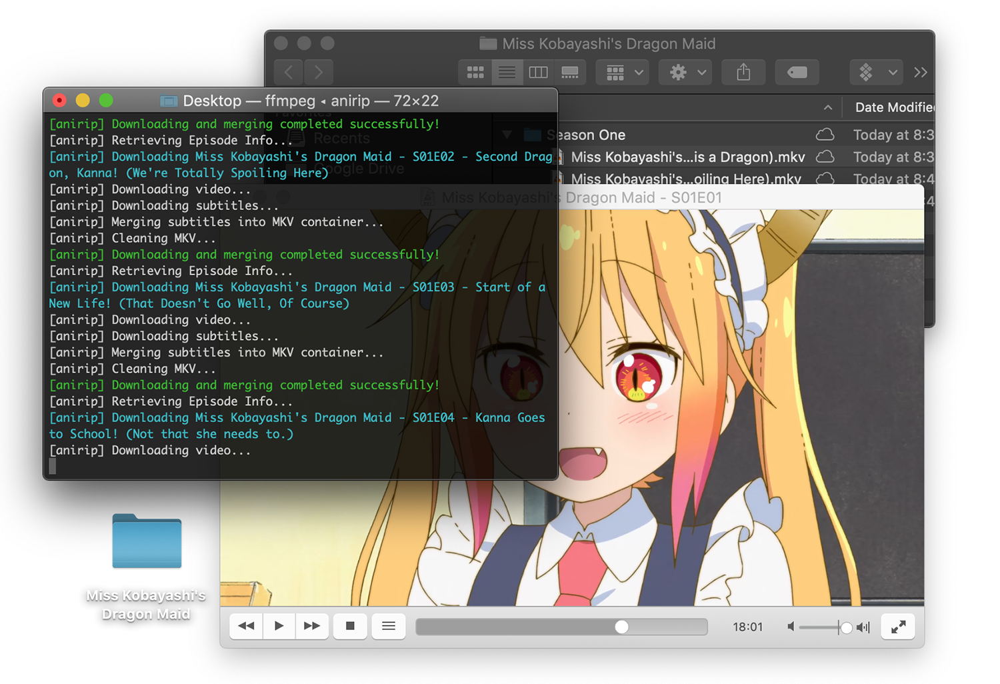

<p align="center">

<br>
<a href="https://circleci.com/gh/s32x/anirip/tree/master"></a>
<a href="https://goreportcard.com/report/s32x.com/anirip"></a>
<a href="https://godoc.org/s32x.com/anirip"></a>
</p>

<p align="center">

</p>

`anirip` is a Crunchyroll episode/subtitle ripper written in Go. It performs all actions associated with downloading video segments, subtitle files, and metadata and muxes them together appropriately.

## Getting Started

### Installing

**1)** Install [`ffmpeg`](https://ffmpeg.org/download.html) if it doesn't already exist on your system. We will using this tool primarily for dumping episode content and editing video metadata.

**2)** Install [`mkclean`](https://sourceforge.net/projects/matroska/files/mkclean/mkclean-win32.v0.8.7.zip) if it doesn't already exist on your system. We use this in order to clean up metadata after each episode has been dumped.

**3)** Install Go and run `go get`. This installs the anirip binary on your local system.
```
$ go get s32x.com/anirip
```

### Usage
To download shows from Crunchyroll :
```
anirip myUsername0123 myPassword5535 http://www.crunchyroll.com/strike-the-blood
```

## Disclaimer
This repo/project was written as an educational intro to web-scraping and network analysis. It is provided publicly as a an open source project for nothing other than educational purposes. I do not take responsibility for how you use this software nor do I recommend you use it in any way that may infringe on Crunchyroll as a business.

## Legal Warning
This application is not endorsed or affiliated with any anime stream provider. The usage of this application enables episodes to be downloaded for offline convenience which may be forbidden by law in your country. Usage of this application may also cause a violation of the agreed Terms of Service between you and the stream provider. A tool is not responsible for your actions; please make an informed decision prior to using this application. Any Stream decryption is done by a third party program, in the case of Crunchyroll by ffmpeg. Usage of third party programs and/or libraries may be forbidden in your country without proper consent of the copyright holder.

The MIT License (MIT)
=====================

Copyright © 2018 Steven Wolfe

Permission is hereby granted, free of charge, to any person
obtaining a copy of this software and associated documentation
files (the “Software”), to deal in the Software without
restriction, including without limitation the rights to use,
copy, modify, merge, publish, distribute, sublicense, and/or sell
copies of the Software, and to permit persons to whom the
Software is furnished to do so, subject to the following
conditions:

The above copyright notice and this permission notice shall be
included in all copies or substantial portions of the Software.

THE SOFTWARE IS PROVIDED “AS IS”, WITHOUT WARRANTY OF ANY KIND,
EXPRESS OR IMPLIED, INCLUDING BUT NOT LIMITED TO THE WARRANTIES
OF MERCHANTABILITY, FITNESS FOR A PARTICULAR PURPOSE AND
NONINFRINGEMENT. IN NO EVENT SHALL THE AUTHORS OR COPYRIGHT
HOLDERS BE LIABLE FOR ANY CLAIM, DAMAGES OR OTHER LIABILITY,
WHETHER IN AN ACTION OF CONTRACT, TORT OR OTHERWISE, ARISING
FROM, OUT OF OR IN CONNECTION WITH THE SOFTWARE OR THE USE OR
OTHER DEALINGS IN THE SOFTWARE.
